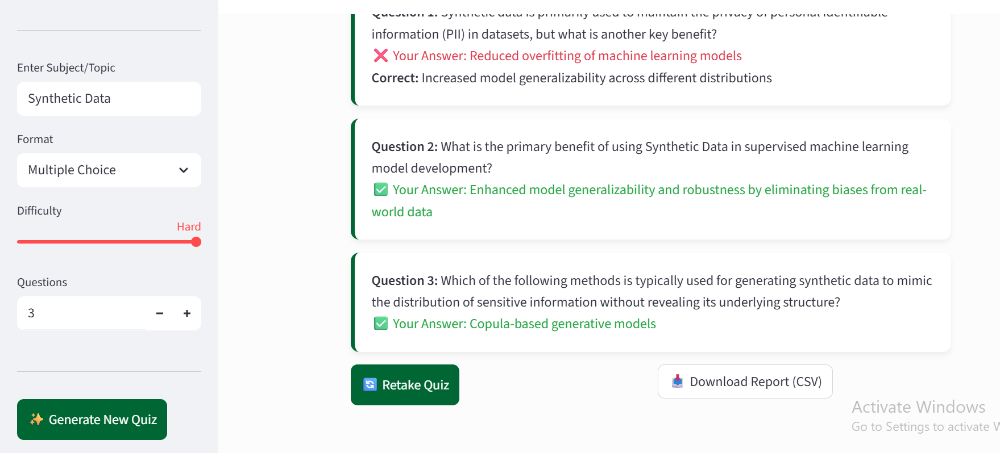
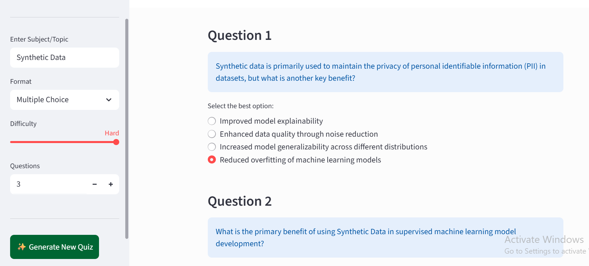
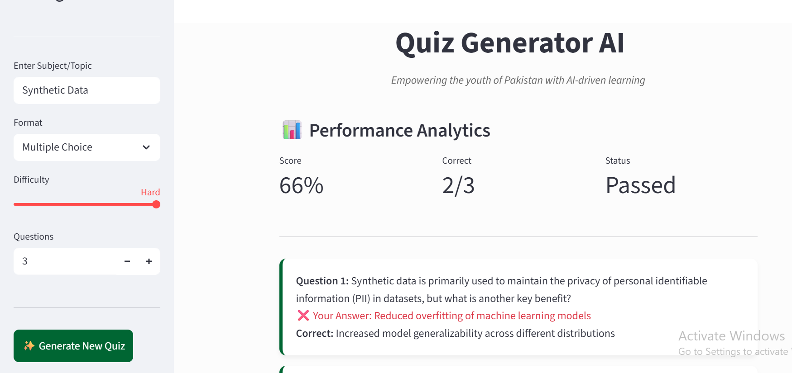

# PeerStudy 🎓
### *Streamlining Collaborative Learning through Data-Driven Insights*

[](https://www.python.org/)
[](https://www.docker.com/)
[](https://opensource.org/licenses/MIT)

**PeerStudy** is a lightweight, containerized Python framework designed to facilitate and analyze peer-to-peer learning environments. Whether managing study groups or analyzing student collaboration patterns, PeerStudy provides the core infrastructure to turn educational data into actionable insights.

---
## 🖼️ Interface Gallery

<p align="center">
  <b>1. Intelligent Quiz Configuration</b><br>
  
</p>

---

<p align="center">
  <b>2. Interactive Assessment Interface</b><br>
  
</p>

---

<p align="center">
  <b>3. Performance Analytics Dashboard</b><br>
  
</p>
## 🚀 Key Features

- **Modular Architecture:** Built with a clean `src/` structure and `setup.py` for seamless package installation.
- **Docker Integration:** Fully containerized with a `Dockerfile`, ensuring consistent behavior across all development and production environments.
- **Scalable Design:** Designed to be easily integrated into larger educational management systems (EMS).
- **Environment Agnostic:** Pre-configured with `.gitignore` and `requirements.txt` for rapid onboarding.

---

## 🛠️ Technical Stack

- **Backend:** Python 3.x
- **Infrastructure:** Docker (for isolated environment execution)
- **Packaging:** Setuptools (for modular distribution)

---

## 📦 Getting Started

### Using Docker (Recommended)
```bash
# Build the image
docker build -t peerstudy .

# Run the container
docker run peerstudy